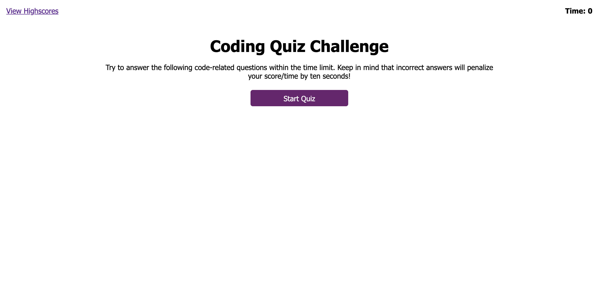

# u4-hw-web-api-code-quiz
ITESM Coding Bootcamp - Unit 4 Homework - Web APIs: Code Quiz

This was a Job-Seeking coding assessment where I was required to build a Code Quiz Challenge website. The application starts displaying the instructions and a Start Quiz button. Once the quiz begins a timer starts counting backwards and questions appear one after another each time the user answers one question. For each wrong question the user gets a penalty of 10 seconds reduced from the timer. When the user answers all questions or the time runs out a screen appears showing the score, an input field to capture the user's initials and a submit button. As soon as the user submits the information another website (separate html file) appears displaying the Highscores in descending order, as well as a Go Back button which returns to the quiz website and a Clear Highscores button that clears the displayed list as well as the browser's local storage. 

For this activity I started writing all the html code to display all the elements of the quiz website as well as the highscores website (with the exception of the &lt;li&gt; elements, which are created when the user submits the score and initials). After that I wrote the code for the css files for both html files, to give the look of the muck-up to my application. 

Now, for the functionality with JavaScript, first I set all the variables to manipulate the html elements with the DOM. After that, I wrote the functions to start the timer using setInterval and to reduce 10 seconds if a wrong answer is selected for each question. For the next part of I added Event Listeners for all the possible answers (buttons). To display each question after another I set attributes for style regarding display none and display block. I used setTimeout to display the "Correct!" and "Wrong!" messages and make them disappear after some time. Then, I used objects, arrays, preventDefault and localStorage to make the Submit button set the score and user initials in the browser's local storage. For the Highscores website I used function init() so that as soon as the webpage is loaded a function transforms the string values in the local storage into objects (with a sort() method to organize them in descending order), then a &lt;li&gt; element is created and appended to a &lt;ol&gt; element, adding at last the object initials value and score value (this is done with a for loop to register all the scores that are set in the local storage). Finally I used window.location.href for the Go Back button and localStorage.clear() for the Clear Highscores button.

The final website looks like this image:

The link for the deployed application is this:

https://josevidmal.github.io/u4-hw-web-api-code-quiz/